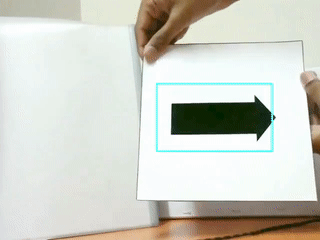

# OpenCV - Arrow Direction Finder

Using `Python 2.7` and `OpenCV version: 3.3.0`

- **HAAR cascade classifier** for detecting arrows is trained.
- Pre-trained classifier is then imported and used to detect arrows inside the image frame.
- Uses **thresholding** with **contour approximation** for shape analysis to find the arrow direction.

